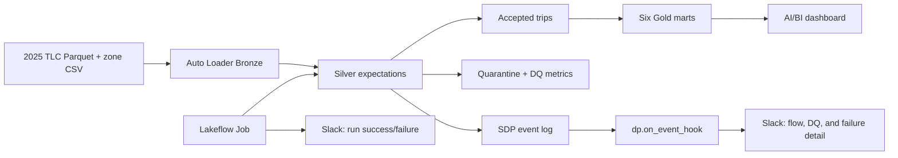
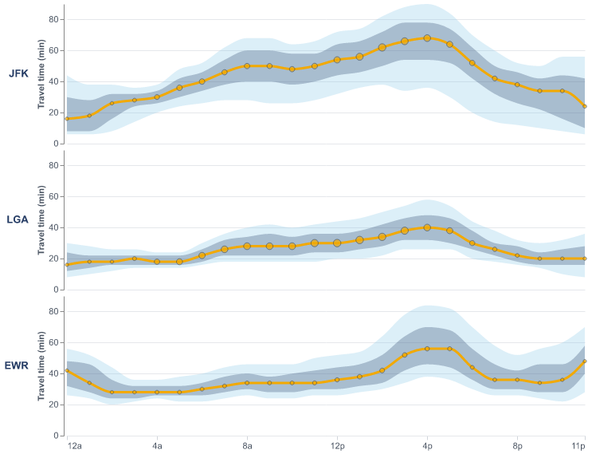
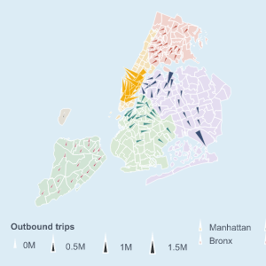
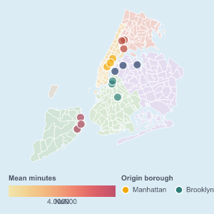
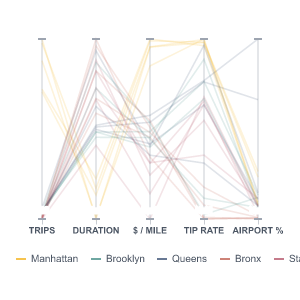
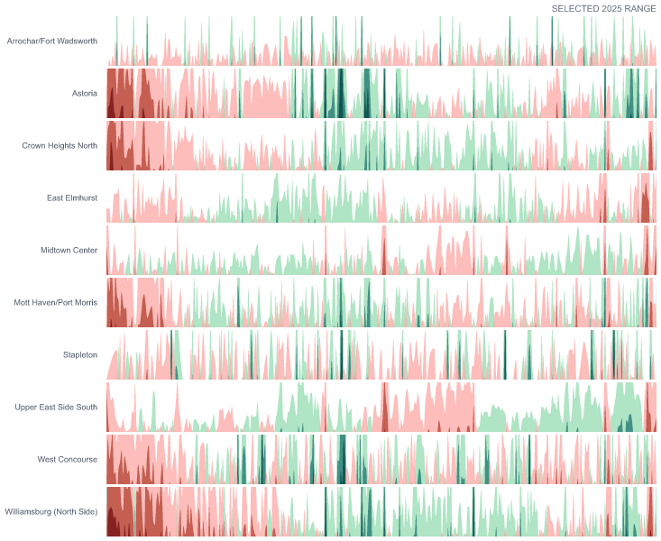
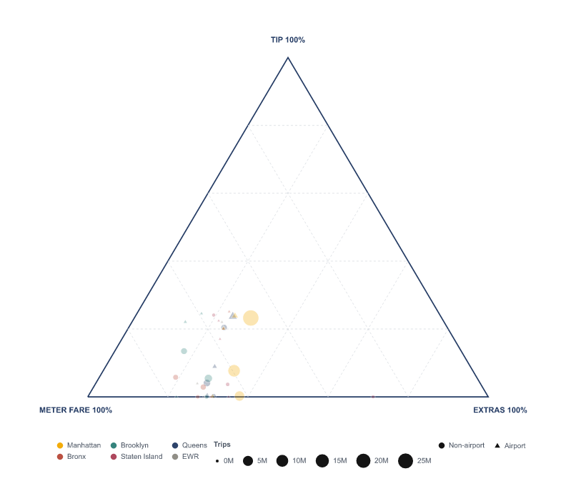

# NYC Taxi Operations Intelligence

An end-to-end Databricks demo that turns the 2025 NYC TLC Yellow Taxi dataset into a production-style AI/BI dashboard. A serverless Lakeflow Spark Declarative Pipeline (SDP) ingests and validates the source data, publishes six purpose-built Gold marts, and is orchestrated by a Lakeflow Job with Slack notifications at both the Job and pipeline-event levels.

The validated demo processes 48.7 million raw trips into 45.2 million accepted Silver records and 3.6 million quarantined records.

## Architecture



Everything is deployable as one Databricks Asset Bundle:

- `resources/nyc_taxi.dashboard.yml` deploys the AI/BI dashboard.
- `resources/nyc_taxi.job.yml` deploys the scheduled/orchestrated Job.
- `resources/nyc_taxi.pipeline.yml` deploys the serverless SDP.
- `src/nyc_taxi_pipeline/` contains Bronze, Silver, quarantine, DQ, Gold, and monitoring code.

## Dashboard visualizations

Four page-level filters—pickup hour, pickup date, pickup borough, and airport trip—apply consistently across all compatible views. The marts store additive measures at daily/hourly filter grain, so visual calculations remain correct across multi-day and multi-hour selections.

### 1. Airport reliability quantile fan



Compares weekday journey-time reliability from selected pickup boroughs to JFK, LGA, and EWR. A pale band represents p10–p90, the darker band is the interquartile range, and the yellow line is the median. The Gold mart stores two-minute duration histograms so quantiles remain composable after dashboard filters are applied.

### 2. Directional flow field



Shows where demand from each pickup zone tends to travel. Each wedge starts at a TLC zone centroid, points toward the trip-weighted mean destination, and scales with outbound volume. The map uses embedded, simplified TLC zone polygons and makes no external tile calls.

### 3. Geographic origin-destination connections



Lets an operator click an origin and reveal its six most common destinations for the active filter slice. Link width encodes trip count and color encodes mean duration. The lines represent network relationships, not driven road routes.

### 4. Operating-regime parallel coordinates



Compares pickup zones across demand, mean journey duration, fare efficiency, card tipping, and airport exposure. Each line is one zone; selecting it isolates a multivariate operating profile that is difficult to see in separate charts.

### 5. Zone-demand horizon



Packs ten demand time series into a compact anomaly view. Each zone/date is compared with its same-weekday and same-hour baseline. Teal indicates above-normal demand, red indicates below-normal demand, and band intensity communicates the size of the departure.

### 6. Fare-composition simplex



Places each pickup-borough × payment-type × airport segment inside a ternary composition of meter fare, recorded tip, and other charges. Point size encodes trips. A square-root display transform spreads dense points for readability while tooltips preserve the true, untransformed receipt shares.

## Slack alerting

The demo has two complementary notification layers.

### Job lifecycle notifications

The Job uses an existing Databricks Slack notification destination and sends:

- Job-level success notifications.
- Job-level failure notifications.
- Pipeline-task failure notifications.

The destination ID is a bundle variable (`slack_notification_destination_id`), so each workspace can supply its own destination without changing source code.

### Granular `dp.on_event_hook` notifications

`send_granular_pipeline_alerts` runs inside SDP and consumes `update_progress` and `flow_progress` events. It emits versioned Slack payloads for:

- Failed, canceled, stopped, skipped, or excluded updates/flows.
- Named expectation failure ratios above the configurable threshold (1% after at least 1,000 evaluated records by default).
- Unexpected zero-row terminal writes for expected output flows.
- Terminal per-flow input/output/upsert/delete, byte, backlog, and expectation metrics when metric delivery is enabled.

The payload includes pipeline/update/flow identity, severity, condition, normalized metrics, expectation counts and ratios, an idempotency key, and a diagnostic workspace URL. Delivery is asynchronous and best-effort, uses a five-second HTTP timeout, and stops invoking the hook after a fourth consecutive failure. The published SDP event log remains the canonical source for replay and audit.

Databricks intentionally masks the credential behind a notification destination, so the granular hook uses a separate Slack incoming-webhook URL stored in a Databricks secret. No webhook URL is committed to this repository.

## Deploy the demo

Prerequisites:

- Databricks CLI 0.281.0 or newer, authenticated to a workspace with serverless SDP and Unity Catalog.
- A SQL warehouse.
- A Unity Catalog volume containing the 12 Yellow Taxi 2025 Parquet files and the taxi-zone CSV expected by the Bronze loaders.
- A Databricks Slack notification destination for Job lifecycle messages.
- Optionally, a Slack incoming webhook for granular SDP events.

Update the defaults in `databricks.yml`, or override these bundle variables for your workspace:

- `catalog`, `target_schema`, `landing_schema`, `landing_volume`, and `metadata_volume`
- `warehouse_id`
- `slack_notification_destination_id`
- `hook_secret_scope`, `hook_secret_key`, and `hook_enabled`

Create the hook secret without placing the webhook in source control:

```bash
databricks secrets create-scope nyc-taxi-monitoring
databricks secrets put-secret nyc-taxi-monitoring slack-webhook-url
```

Then validate, deploy, and run:

```bash
databricks bundle validate -t dev
databricks bundle deploy -t dev
databricks bundle run nyc_taxi_dashboard_refresh -t dev
```

Enable granular Slack delivery at deployment time:

```bash
databricks bundle deploy -t dev --var hook_enabled=true
```

Development mode prefixes resource names and the target schema with the current user. Use a separate production target and controlled schema ownership cutover before pointing a production dashboard at replacement tables.

## Build and validate the dashboard

Install the local validation dependencies:

```bash
uv venv
uv pip install -r requirements-dev.txt
```

Rebuild the dashboard source with deployment defaults:

```bash
DATABRICKS_WAREHOUSE_ID=your-warehouse-id \
DATABRICKS_DASHBOARD_PARENT_PATH=/Users/your-user-name \
uv run scripts/build_dashboard.py
```

Run the static contract and Vega-Lite checks:

```bash
uv run scripts/validate_dashboard.py
```

The live validator executes every dashboard dataset query, checks widget field contracts, tests a combined Q4/Queens/Airport/hours 08–09 filter scenario, and renders all six Vega-Lite views:

```bash
uv run scripts/validate_dashboard_queries.py \
  --profile your-profile \
  --warehouse-id your-warehouse-id \
  --catalog your-catalog \
  --schema your-schema
```

## Data-quality contract

Silver applies six named expectations covering the expected pickup year, chronological pickup/dropoff order, 1–180 minute duration, 0.1–100 mile distance, nonnegative bounded total amount, and valid TLC location IDs. Invalid rows retain every rejection reason in quarantine, while `yellow_trips_2025_dq_metrics` publishes total, accepted, rejected, per-rule failure counts, and failure rates.

The repository includes a reversible failure drill (`failure_drill.py`) for validating the notification path without permanently changing the production rules.

## Repository layout

```text
dashboards/                 AI/BI dashboard source
docs/images/                Rendered visualization previews
resources/                  Bundle dashboard, Job, pipeline, schema, and volume
scripts/                    Dashboard build and validation utilities
specs/                      Vega-Lite specifications and embedded basemap
sql/                        Original mart/query development SQL
src/nyc_taxi_pipeline/      Bronze, Silver, Gold, DQ, and event-hook code
databricks.yml              Asset Bundle entry point and variables
```

Source code is available under the MIT License. NYC TLC data remains governed by its source terms.
